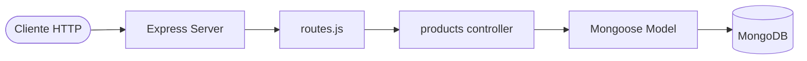

<div align="center">


### Express · MongoDB · CRUD de produtos


<br/>

[](https://brayansilver.github.io)
[](https://github.com/BrayanSilver)
[](https://www.linkedin.com/in/brayan-r-silveira-b80636150/)
[](mailto:brayansilver.teen@gmail.com)


</div>

---

## 📌 Sobre

API REST introdutória com **Express + Mongoose** para CRUD de produtos: rotas, controllers, models e conexão MongoDB.

## 📊 Status cards

<div align="center">
  
  
</div>

## 🔄 Arquitetura



## ▶️ Como rodar

```bash
npm install
# configure MONGODB_URI no ambiente / db.js
npm run dev
```

API tipicamente em `http://localhost:3000`

## 📁 Estrutura

```
API_Restful/
├── src/
│   ├── server.js
│   ├── routes/
│   ├── controllers/
│   ├── models/
│   └── database/
└── package.json
```

> 💡 Dica: grave um GIF curto do Insomnia/Postman batendo nos endpoints e salve como `demo.gif` na raiz para enriquecer este README.

---

<div align="center">

**Brayan R. Silveira** · Full Stack Developer

[Portfolio](https://brayansilver.github.io) · [GitHub](https://github.com/BrayanSilver) · [LinkedIn](https://www.linkedin.com/in/brayan-r-silveira-b80636150/)


</div>
